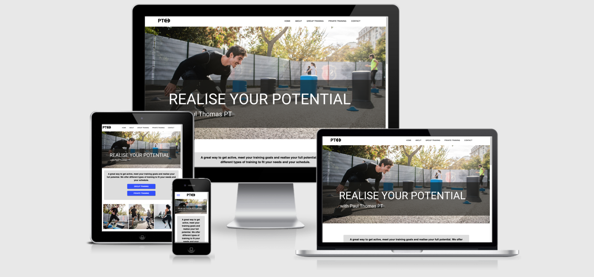
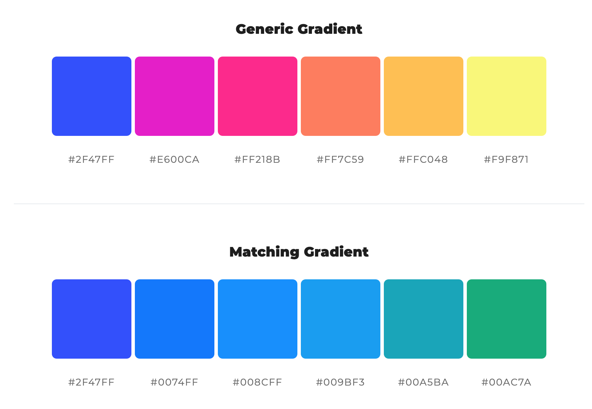

# Paul Thomas PT
(Developer: Paul Thomas O´Riordan)

[Live webpage](https://rashdogg74.github.io/paul_thomas_pt/)

## Table of Contents

1. [Project Goals](#project-goals)
    1. [User Goals](#user-goals)
    2. [Site Owner Goals](#site-owner-goals)
2. [User Experience](#user-experience)
    1. [Target Audience](#target-audience)
    2. [User Requrements and Expectations](#user-requrements-and-expectations)
    3. [User Stories](#user-stories)
3. [Design](#design)
    1. [Design Choices](#design-choices)
    2. [Colour](#colours)
    3. [Fonts](#fonts)
    4. [Structure](#structure)
    5. [Wireframes](#wireframes)
4. [Technologies Used](#technologies-used)
    1. [Languages](#languages)
    2. [Frameworks & Tools](#frameworks-&-tools)
5. [Features](#features)
6. [Testing](#validation)
    1. [HTML Validation](#HTML-validation)
    2. [CSS Validation](#CSS-validation)
    3. [Accessibility](#accessibility)
    4. [Performance](#performance)
    5. [Device testing](#performing-tests-on-various-devices)
    6. [Browser compatibility](#browser-compatability)
    7. [Testing user stories](#testing-user-stories)
8. [Bugs](#Bugs)
9. [Deployment](#deployment)
10. [Credits](#credits)
11. [Acknowledgements](#acknowledgements)

## Project Goals

### User Goals
- To find a bilingual personal trainer in Madrid city centre.
- To find outdoor group training sessions in Madrid city centre.
- To reference class times, locations and types.
- Research information on Paul Thomas PT.
- Sign up and/or request more information on services provided. 

### Site Owner Goals
- Increase the number of personal training clients.
- Increase the number of group training clients.
- Promote the personal training business and brand.
- Provide a method for new and existing customers to connect with the buissnes.
- Provide a fixed point for all sign ups for the business. 

## User Experience

### Target Audience
- Individuals looking to make a healthy change in their lifestyle.
- Individuals looking to meet new people in Madrid ciy centre in an active, fun environment.
- Groups of individuals looking for a group fitness class.
- Individuals looking to push themselves further or improve their fitness.

### User Requirements and Expectations

- A simple and intuitive navigation system.
- Quickly and easily find relevant information.
- Links that work as expected.
- Well presented and a visually appealing design regardless of device.
- An easy way to contact the business.
- Accessibility.

### User Stories

#### First-time User 
1. As a first time user, I want to know what services are offered by Paul Thomas PT.
2. As a first time user, I want to know times, locations and types of classes offered.
3. As a first time user, I want to know how to get in contact with the trainer and request more information/ have an initial consultation. 
4. As a first time user, I want to get a feel of what to expect in a group/private fitness class.

#### Returning User
5. As a returning user, I want to see the times, types and locations of classes.
6. As a returnign user, I want to get in contact with the trainer.
7. As a returning user, I want to find a social media link to connect with the business.
8. As a returning user, I want to find out a little more about Paul Thomas background.
9. As a returning user, I want to leave some comment, suggestion or message to the staff.
10. As a returning user, I want to get directions to the classes.

#### Site Owner 
11. As the site owner, I want users to interact with my brand, get to know me, the services I offer and sign up for more information.
12. As the site owner, I want users to get a feel for the types of services offered.
13. As the site owner, I want users to be able to see some client testimonies.

## Design

### Design Choices
The webpage was designed with my own personal style and training style in mind. Clean, to the point and focussed on what I want to achieve. Focus was put on images of people enjoying themselves and working hard, both in private and group classes. 

### Colour
For the colour scheme cool and vibrant colors were chosen to reflect the calmness and simplicity of my own character and the services I offer, as well as being energetic and inspiring movement and vibrance. 
 

### Fonts
Roboto was used for the logo and the headings throughout the site. The logic behind this was to maintain style and simplicity throughout the site and call attention to key information.
 
Source-sans-pro was chosen for the body text of the website, this font combines very well with Roboto and again maintains the clean simplistic approach site-wide. 

### Structure
The page is structured in a well know, recognizable, user friendly, and easy to learn way. Upon arriving to the website the user sees a familiar type of navigation bar with the restaurant logo on the left side and the navigation links to the right. 
The website consists of five separate pages: 
- A homepage with a brief introduction to the services offered, a call to action as well as a short description of "how it works".
- An about page with information about me, my credentials, background, hobbies and interests to give the user an opportunity to get to know me. 
- A group training page, with a call to action, group class times and locations, and some information on the types of training offered. 
- A private training page, with a call to action, 2 options and a breakdown of the different servcies offered. 
- A contact page with a text input area to allow customers to get in contact regarding anything they would like to know or say. 

### Wireframes

Home

About

Menu

Gallery

Contact

## Technologies Used

### Languages
- HTML
- CSS

### Frameworks & Tools
- Git
- GitHub
- Gitpod
- Convertio
- Canva
- Balsamiq
- Adobexd
- Google Fonts
- Color Space
- Font Awsome
- Favicon

## Features
The page consists of five pages and the main features include training images, links to sign up, ways to contact and connect with the business and client testimonies. 

### Logo and Navigation Bar
- Featured on all five pages.
- The navbar is fully responsive and changes to a toggler (hamburger menu) on smaller screens and includes links to the Homepage, About page, Group training, Private training page and Contact page.
- If a user hovers over a nav bar option in desktop mode a animated bar shows them which option they are choosing. 

### Footer
- Featured on all five pages.
- Consists of two seperate sections: social media links and business details.

### About 
- Gives a description of me, my credentials, hobbies, interests and main training philosophy.

### Client testimonies 
- Features a few testimonies left by customers

### Group training
- Features imagery, class timetable and a sign up form for people to get involved.

### Private/Remote training
- Features imagery, short description of services offered and a sign up form for people to get involved.

### Images included
- Some images of myself, private and group fitness classes aloowing users to see the type of environment they would be training in. 

### Contact page
- A way for clients or prospective clients to provide feedback, ask for details, advice, whatever.

### Map
- Shows the group class locations on an embeded Google Map.

### User stories covered
- All of the above highlights user stories 1-13 being covered.

## Validation

### HTML Validation
The W3C Markup Validation Service was used to validate the HTML of the website. All pages passed with no errors nor warnings to show.

Home

About

Menu

Gallery

Home

### CSS Validation
The W3C Jigsaw CSS Validation Service was used to validate the CSS of the website.
When validating the page as a whole, the validator shows some errors linked to Bootstrap v5.0. When validating just my own custom CSS it passes with no errors found and some warnings associated to using root variables.

whole page

style.css

### Accessibility
The WAVE WebAIM web accessibility evaluation tool was used to ensure the website met high accessibility standards. All pages pass with 0 errors.

Home

About

Menu

Gallery

Contact

### Performance 
Google Lighthouse in Google Chrome Developer Tools was used to test the performance of the website. 

Home

About

Menu

Gallery

Contact

### Performing tests on various devices 
The website was tested on the following devices:
- HP desktop
- Macbook
- iPad
- iPhone X
- Huawei mobile

In addition, the site was tested using Google Chrome Developer Tools Device Toggeling option for all available device options.

### Browser compatability
The website was tested on the following browsers:
- Google Chrome
- Mozilla Firefox
- Safari

### Testing user stories

1. As a first time user, I want to know what services are offered by Paul Thomas PT.

| **Feature** | **Action** | **Expected Result** | **Actual Result** |
|-------------|------------|---------------------|-------------------|
| Map | Navigate to the Contact Us page, locate the Google Map | Locating a map showing the location of the restaurant | Works as expected |
| Footer - contact information section | On any page scroll down to the footer | Find the address of the restaurant | Works as expected |

Screenshots

2. As a first time user, I want to know times, locations and types of classes offered.

| **Feature** | **Action** | **Expected Result** | **Actual Result** |
|-------------|------------|---------------------|-------------------|
| Menu | Navigate to the Menu page | See prices on menu page | Works as expected |

Screenshots

3. As a first time user, I want to know how to get in contact with the trainer and request more information/ have an initial consultation. 

| **Feature** | **Action** | **Expected Result** | **Actual Result** |
|-------------|------------|---------------------|-------------------|
| About Us | Navigate to the About page and locate the About Us section | Find description of the restaurant | Works as expected |
| Customer reviews | Navigate to the About page, scroll down to What our guests say section | Read customer reviews | Works as expected | 

Screenshots

4. As a first time user, I want to get a feel of what to expect in a group/private fitness class.

| **Feature** | **Action** | **Expected Result** | **Actual Result** |
|-------------|------------|---------------------|-------------------|
| Gallery | Navigate to the Gallery page | Find pictures of the restaurant and food served there | Works as expected |
| Promo video | Navigate to the GAlelry page and scroll to the promo video | Watch promo video | Works as expected |

Screenshots

5. As a returning user, I want to see the times, types and locations of classes.

| **Feature** | **Action** | **Expected Result** | **Actual Result** |
|-------------|------------|---------------------|-------------------|
| Meal-deal | On home page scroll down to the Sunday meal deal section | Find the meal-deal for the upcomming Sunday | Works as expected |

Screenshots

6. As a returnign user, I want to get in contact with the trainer.

| **Feature** | **Action** | **Expected Result** | **Actual Result** |
|-------------|------------|---------------------|-------------------|
| Footer - opening times section | On any page scroll to the footer | See opening times | Works as expected |

Screenshots

7. As a returning user, I want to find a social media link to connect with the business.

| **Feature** | **Action** | **Expected Result** | **Actual Result** |
|-------------|------------|---------------------|-------------------|
| Footer - contact information section | On any page scroll to the footer | See phone number | Works as expected |
| Info Box | Navigate to Contact Us page and locate the How to find us section | See phone number | Works as expected |

Screenshots

8. As a returning user, I want to find out a little more about Paul Thomas background.

| **Feature** | **Action** | **Expected Result** | **Actual Result** |
|-------------|------------|---------------------|-------------------|
| Menu | Navigate to the menu page | Read the menu | Works as expected |

Screenshots

9. As a returning user, I want to leave some comment, suggestion or message to the staff.

| **Feature** | **Action** | **Expected Result** | **Actual Result** |
|-------------|------------|---------------------|-------------------|
| Contact Form | Navigate to the Contact Us Page and locate the contact form, fill out and submit contact form | Data submited via contact form | Works as expectd |

Screenshots

10. As a returning user, I want to get directions to the classes.

| **Feature** | **Action** | **Expected Result** | **Actual Result** |
|-------------|------------|---------------------|-------------------|
| Footer - social media section | On any page scroll to the bottom | Click on social media links | Works as expected | 

Screenshots

11. As the site owner, I want users to interact with my brand, get to know me, the services I offer and sign up for more information.

| **Feature** | **Action** | **Expected Result** | **Actual Result** |
|-------------|------------|---------------------|-------------------|
| Meet the Chef | Navigate to the About page and scroll down to Meet the Chef section | Find brief bio of the Chef | Works as expected |

Screenshots

12. As the site owner, I want users to get a feel for the types of services offered.

| **Feature** | **Action** | **Expected Result** | **Actual Result** |
|-------------|------------|---------------------|-------------------|
| Map | Navigate to the Contact Us page, locate the map and click on directions link | See directions to the restaurant on Goole Maps | Works as expected |

Screenshots

13. As the site owner, I want users to be able to see some client testimonies.

| **Feature** | **Action** | **Expected Result** | **Actual Result** |
|-------------|------------|---------------------|-------------------|
| News | Scroll down on home page and locate news section | Find latest news | Works as expected |

Screenshots

## Bugs

| **Bug** | **Fix** |
| ----------- | ----------- |
| Home page link stays highlighted when visiting another page | Change active atribute to the correct page |
| The user can submit a contact form input without a message | Add required attribute to message input field |
| Navbar divides into two rows on xs screen size | Add a media query to remove the right margin of the logo in the navbar on xs screen |
| Email overflows on xs screen size | Add a media query that makes the divs spread to 100% width on xs sreens to froce the content onto a seperate line |
| When viewed on tablets, the contact page has whitespace after the footer | Set min-height for body to 100vh |

## Deployment
The website was deployed using GitHub Pages by following these steps:
1. In the GitHub repository navigate to the Settings tab
2. On the left hand menu select Pages
3. For the source select Branch: master
4. After the webpage refreshes automaticaly you will se a ribbon on the top saying: "Your site is published at https://4n4ru.github.io/CI_MS1_BodelschwingherHof/"

You can for fork the repository by following these steps:
1. Go to the GitHub repository
2. Click on Fork button in upper right hand corner

You can clone the repository by following these steps:
1. Go to the GitHub repository 
2. Locate the Code button above the list of files and click it 
3. Select if you prefere to clone using HTTPS, SSH, or Github CLI and click the copy button to copy the URL to your clipboard
4. Open Git Bash
5. Change the current working directory to the one where you want the cloned directory
6. Type git clone and paste the URL from the clipboard ($ git clone https://github.com/YOUR-USERNAME/YOUR-REPOSITORY)
7.Press Enter to create your local clone.

## Credits
Images not referenced below are owned by the developer.

### Media
In order of apearance:
- [carousel-1](assets/images/carousel-1.jpg): Photo by <a href="https://unsplash.com/@heathergill?utm_source=unsplash&utm_medium=referral&utm_content=creditCopyText">Heather Gill</a> on <a href="https://unsplash.com/s/photos/pots-and-pans?utm_source=unsplash&utm_medium=referral&utm_content=creditCopyText">Unsplash</a>
- [news](assets/images/news.jpg): Photo by <a href="https://unsplash.com/@mareksminder?utm_source=unsplash&utm_medium=referral&utm_content=creditCopyText">Claudia Altamimi</a> on <a href="https://unsplash.com/?utm_source=unsplash&utm_medium=referral&utm_content=creditCopyText">Unsplash</a>
- [meal-deal](assets/images/meal-deal.jpg): Photo by <a href="https://unsplash.com/@itssammoqadam?utm_source=unsplash&utm_medium=referral&utm_content=creditCopyText">Sam Moqadam</a> on <a href="https://unsplash.com/?utm_source=unsplash&utm_medium=referral&utm_content=creditCopyText">Unsplash</a> 
- [chef](assets/images/chef.jpg): <a href='https://www.freepik.com/photos/food'>Food photo created by freepik - www.freepik.com</a>
- [menu background](assets/images/menu-background.jpg): <a href="https://www.freepik.com/vectors/background">Background vector created by pikisuperstar - www.freepik.com</a>
- [starter](assets/images/starter.jpg) Photo by <a href="https://unsplash.com/@margzu?utm_source=unsplash&utm_medium=referral&utm_content=creditCopyText">Margarita Zueva</a> on <a href="https://unsplash.com/?utm_source=unsplash&utm_medium=referral&utm_content=creditCopyText">Unsplash</a>
- [main meal](assets/images/main-meal.jpg) Photo by <a href="https://unsplash.com/@keriliwi?utm_source=unsplash&utm_medium=referral&utm_content=creditCopyText">Keriliwi</a> on <a href="https://unsplash.com/?utm_source=unsplash&utm_medium=referral&utm_content=creditCopyText">Unsplash</a>
- [kids meal](assets/images/kids-meal.jpg) Photo by <a href="https://unsplash.com/@itssammoqadam?utm_source=unsplash&utm_medium=referral&utm_content=creditCopyText">Sam Moqadam</a> on <a href="https://unsplash.com/?utm_source=unsplash&utm_medium=referral&utm_content=creditCopyText">Unsplash</a>
- [dessert](assets/images/dessert.jpg) Photo by <a href="https://unsplash.com/@almapapi?utm_source=unsplash&utm_medium=referral&utm_content=creditCopyText">Krisztina Papp</a> on <a href="https://unsplash.com/?utm_source=unsplash&utm_medium=referral&utm_content=creditCopyText">Unsplash</a>
- [wine](assets/images/wine.jpg) Photo by <a href="https://unsplash.com/@biljaminai?utm_source=unsplash&utm_medium=referral&utm_content=creditCopyText">Biljana Martinic</a> on <a href="https://unsplash.com/?utm_source=unsplash&utm_medium=referral&utm_content=creditCopyText">Unsplash</a>
- [salad](assets/images/salad.jpg): Photo by <a href="https://unsplash.com/@itssammoqadam?utm_source=unsplash&utm_medium=referral&utm_content=creditCopyText">Sam Moqadam</a> on <a href="https://unsplash.com/?utm_source=unsplash&utm_medium=referral&utm_content=creditCopyText">Unsplash</a>
- [fish](assets/images/fish.jpg): Photo by <a href="https://unsplash.com/@itssammoqadam?utm_source=unsplash&utm_medium=referral&utm_content=creditCopyText">Sam Moqadam</a> on <a href="https://unsplash.com/?utm_source=unsplash&utm_medium=referral&utm_content=creditCopyText">Unsplash</a>
- [chicken](assets/images/chicken.jpg): Photo by <a href="https://unsplash.com/@itssammoqadam?utm_source=unsplash&utm_medium=referral&utm_content=creditCopyText">Sam Moqadam</a> on <a href="https://unsplash.com/?utm_source=unsplash&utm_medium=referral&utm_content=creditCopyText">Unsplash</a>
- [404 error image](assets/images/404-error.png): <a href='https://www.freepik.com/vectors/background'>Background vector created by freepik - www.freepik.com</a>
  
### Code
In order of apearance:
- The HTML for the responsive [Navbar with toggler](https://getbootstrap.com/docs/5.0/components/navbar/#toggler) was taken from the Bootstrap v5.0 documentation code snippet and combined with their [Navbar with Pills](https://getbootstrap.com/docs/5.0/components/navs-tabs/#pills)
- [Carousel](https://getbootstrap.com/docs/5.0/components/carousel/#with-indicators) on index page was taken from Bootrap v5.0 documentation code snippet
- CSS code to avoid whitespace below footer was taken from a forum post on [FreeCodeCamp](https://forum.freecodecamp.org/t/footer-white-space-below/191360)
- 404 page was build using description on [GitHub Docs](https://docs.github.com/en/pages/getting-started-with-github-pages/creating-a-custom-404-page-for-your-github-pages-site)

## Acknowledgements
I would like to take the opportunity to thank:
- My mentor Mo Shami for his feedback, advice, guidance and support.
- My partner Ashley for supporting me, giving me critical feedback and having patience and understanding when I needed to vent my frustrations.
- To the lovely people on the Code Institute Slack for encouraging all the way.
- To the Code Institute tutors for helping me with a couple of critical issues.
- To my coworkers at Hastings school, Madrid for encouraging me and offering me help when needed with workload.
