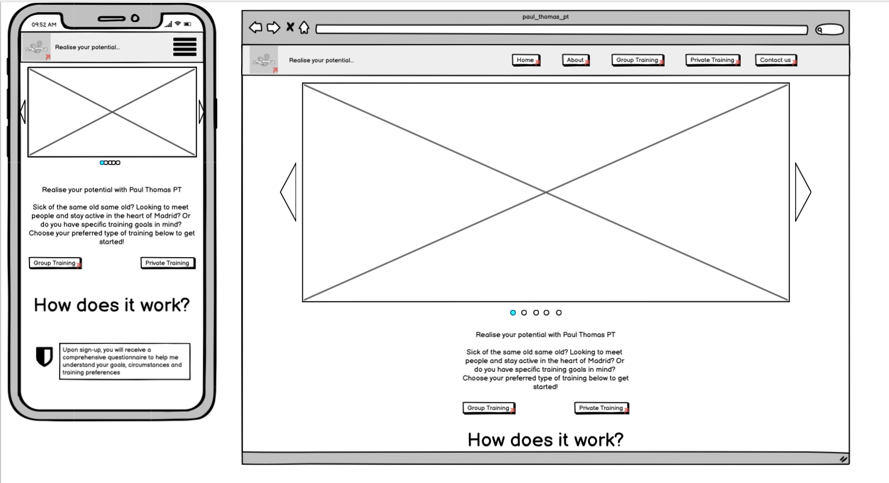

# Paul Thomas PT
(Developer: Paul Thomas O´Riordan)

[Live webpage](https://rashdogg74.github.io/paul_thomas_pt/)

## Table of Contents

1. [Project Goals](#project-goals)
    1. [User Goals](#user-goals)
    2. [Site Owner Goals](#site-owner-goals)
2. [User Experience](#user-experience)
    1. [Target Audience](#target-audience)
    2. [User Requrements and Expectations](#user-requrements-and-expectations)
    3. [User Stories](#user-stories)
3. [Design](#design)
    1. [Design Choices](#design-choices)
    2. [Colour](#colours)
    3. [Fonts](#fonts)
    4. [Structure](#structure)
    5. [Wireframes](#wireframes)
4. [Technologies Used](#technologies-used)
    1. [Languages](#languages)
    2. [Frameworks & Tools](#frameworks-&-tools)
5. [Features](#features)
6. [Testing](#validation)
    1. [HTML Validation](#HTML-validation)
    2. [CSS Validation](#CSS-validation)
    3. [Accessibility](#accessibility)
    4. [Performance](#performance)
    5. [Device testing](#performing-tests-on-various-devices)
    6. [Browser compatibility](#browser-compatability)
    7. [Testing user stories](#testing-user-stories)
8. [Bugs](#Bugs)
9. [Deployment](#deployment)
10. [Credits](#credits)
11. [Acknowledgements](#acknowledgements)

## Project Goals

### User Goals
- To find a bilingual personal trainer in Madrid city centre.
- To find outdoor group training sessions in Madrid city centre.
- To reference class times, locations and types.
- Research information on Paul Thomas PT.
- Sign up and/or request more information on services provided. 

### Site Owner Goals
- Increase the number of personal training clients.
- Increase the number of group training clients.
- Promote the personal training business and brand.
- Provide a method for new and existing customers to connect with the business.
- Provide a fixed point for all sign ups for the business. 

## User Experience

### Target Audience
- Individuals looking to make a healthy change in their lifestyle.
- Individuals looking to meet new people in Madrid ciyy centre in an active, fun environment.
- Groups of individuals looking for a group fitness class.
- Individuals looking to push themselves further or improve their fitness.

### User Requirements and Expectations

- A simple and intuitive navigation system.
- Quickly and easily find relevant information.
- Links that work as expected.
- Well presented and a visually appealing design regardless of device.
- An easy way to contact the business.
- Accessibility.

### User Stories

#### First-time User 
1. As a first time user, I want to know what services are offered by Paul Thomas PT.
2. As a first time user, I want to know times, locations and types of classes offered.
3. As a first time user, I want to know how to get in contact with the trainer and request more information/ have an initial consultation. 
4. As a first time user, I want to get a feel of what to expect in a group/private fitness class.

#### Returning User
5. As a returning user, I want to see the times, types and locations of classes.
6. As a returning user, I want to get in contact with the trainer.
7. As a returning user, I want to find a social media link to connect with the business.
8. As a returning user, I want to find out a little more about Paul Thomas background.
9. As a returning user, I want to leave some comment, suggestion or message to the staff.
10. As a returning user, I want to get directions to the classes.

#### Site Owner 
11. As the site owner, I want users to interact with my brand, get to know me, the services I offer and sign up for more information.
12. As the site owner, I want users to get a feel for the types of services offered.
13. As the site owner, I want users to be able to see some client testimonies.

## Design

### Design Choices
The webpage was designed with my own personal style and training style in mind. Clean, to the point and focussed on what I want to achieve. Focus was put on images of people enjoying themselves and working hard, both in private and group classes. 

### Colour
For the colour scheme cool and vibrant colors were chosen to reflect the calmness and simplicity of my own character and the services I offer, as well as being energetic and inspiring movement and vibrance. 
 

### Fonts
Roboto was used for the logo and the headings throughout the site. The logic behind this was to maintain style and simplicity throughout the site and call attention to key information.
 
Source-sans-pro was chosen for the body text of the website, this font combines very well with Roboto and again maintains the clean simplistic approach site-wide. 

### Structure
The page is structured in a well known, recognizable, user-friendly, and easy to learn manner. Upon arriving at the website the user sees a familiar type of navigation bar with the business' logo on the left side and the navigation links to the right. 
The website consists of five separate pages: 
- A homepage with a brief introduction to the services offered, a call to action as well as a short description of "how it works".
- An about page with information about me, my credentials, background, hobbies and interests to give the user an opportunity to get to know me. 
- A group training page, with a call to action, group class times and locations, and some information on the types of training offered. 
- A private training page, with a call to action, 2 options and a breakdown of the different services offered. 
- A contact page with a text input area to allow customers to get in contact regarding anything they would like to know or say. 

### Wireframes

Shown below are the initial wireframes which changed throughout the development process. Reasons include: increasing subject knowledge of UX design and CSS options, removal of bootstrap elements, the need for a cleaner more streamlined design. 

- Home

- About 

- Group Training 

- Private Training 

- Contact 

## Technologies Used

### Languages
- HTML
- CSS

### Frameworks & Tools
- Git
- GitHub
- Gitpod
- Convertio
- Canva
- Balsamiq
- Adobexd
- Google Fonts
- Color Space
- Font Awesome
- Favicon

## Features
The page consists of five pages and the main features include training images, links to sign up, ways to contact and connect with the business and client testimonies. 

### Logo and Navigation Bar
- Featured on all five pages.
- The navbar is fully responsive and changes to a toggler (hamburger menu) on smaller screens and includes links to the Homepage, About page, Group training, Private training page and Contact page.
- If a user hovers over a nav bar option in desktop mode an animated bar shows them which option they are choosing. 

### Footer
- Featured on all five pages.
- Consists of two seperate sections: social media links and business details.

### About 
- Gives a description of me, my credentials, hobbies, interests and main training philosophy.

### Client testimonies 
- Features a few testimonies left by customers

### Group training
- Features imagery, class timetable and a sign up form for people to get involved.

### Private/Remote training
- Features imagery, short description of services offered and a sign up form for people to get involved.

### Images included
- Some images of myself, private and group fitness classes allowing users to see the type of environment they would be training in. 

### Contact page
- A way for clients or prospective clients to provide feedback, ask for details, advice, whatever.

### Map
- Shows the group class locations on an embedded Google Map.

### User stories covered
- All of the above highlights user stories 1-13 being covered.

## Validation

### HTML Validation
The W3C Markup Validation Service was used to validate the HTML of the website. All pages passed with no errors nor warnings to show.

### CSS Validation
The W3C Jigsaw CSS Validation Service was used to validate the CSS of the website.
When validating the page as a whole, the validator shows some errors linked to Bootstrap v5.0. When validating just my own custom CSS it passes with no errors found and some warnings associated to using root variables.

### Accessibility
The WAVE WebAIM web accessibility evaluation tool was used to ensure the website met high accessibility standards. All pages pass with 1 errors. This error is due to a label which must be included for the toggle menu (burger menu) to work functionally only using CSS (no bootstrap).

### Performance 
Google Lighthouse in Google Chrome Developer Tools was used to test the performance of the website. The best practices score was lower than expected becuase of large images sizes. 

### Performing tests on various devices 
The website was tested on the following devices:
- HP desktop
- Macbook
- iPad
- iPhone X
- Huawei mobile

In addition, the site was tested using Google Chrome Developer Tools Device Toggling option for all available device options.

### Browser compatibility
The website was tested on the following browsers:
- Google Chrome
- Mozilla Firefox
- Safari

### Testing user stories

1. As a first time user, I want to know what services are offered by Paul Thomas PT.

| **Feature** | **Action** | **Expected Result** | **Actual Result** |
|-------------|------------|---------------------|-------------------|
| Home page | Navigate to the type of training you are most interested in | Locating group or private training information | Works as expected |
| Footer - social media links | On any page scroll down to the footer | Find the links to the social media accounts | Works as expected |

2. As a first time user, I want to know times, locations and types of classes offered.

| **Feature** | **Action** | **Expected Result** | **Actual Result** |
|-------------|------------|---------------------|-------------------|
| Group / Private training pages | Navigate to the Menu  | See training options and descriptions | Works as expected |

3. As a first time user, I want to know how to get in contact with the trainer and request more information/ have an initial consultation. 

| **Feature** | **Action** | **Expected Result** | **Actual Result** |
|-------------|------------|---------------------|-------------------|
| Contact page | Navigate to the contact page and locate the form | Find and fill out contact form | Works as expected |
| Footer-social media links  | On any page scroll down to the footer | Contact via social media platform of your choice | Works as expected | 

4. As a first time user, I want to get a feel of what to expect in a group/private fitness class.

| **Feature** | **Action** | **Expected Result** | **Actual Result** |
|-------------|------------|---------------------|-------------------|
| Gallery | Navigate to the home page or either training page | Find pictures of the classes | Works as expected |

5. As a returning user, I want to see the times, types and locations of classes.

| **Feature** | **Action** | **Expected Result** | **Actual Result** |
|-------------|------------|---------------------|-------------------|
| Group-training page | Navigate to the group training page and locate the class table | Find the class schedule | Works as expected |

6. As a returning user, I want to get in contact with the trainer.

| **Feature** | **Action** | **Expected Result** | **Actual Result** |
|-------------|------------|---------------------|-------------------|
| Contact page | Navigate to the contact page and locate the form | Find and fill out contact form | Works as expected |
| Footer-social media links  | On any page scroll down to the footer | Contact via social media platform of your choice | Works as expected | 

7. As a returning user, I want to find a social media link to connect with the business.

| **Feature** | **Action** | **Expected Result** | **Actual Result** |
|-------------|------------|---------------------|-------------------|
| Footer-social media links  | On any page scroll down to the footer | Contact via social media platform of your choice | Works as expected | 

8. As a returning user, I want to find out a little more about Paul Thomas background.

| **Feature** | **Action** | **Expected Result** | **Actual Result** |
|-------------|------------|---------------------|-------------------|
| About page | Navigate to the contact page and locate the section on Paul Thomas | Read the page | Works as expected |

9. As a returning user, I want to leave some comment, suggestion or message to the staff.

| **Feature** | **Action** | **Expected Result** | **Actual Result** |
|-------------|------------|---------------------|-------------------|
| Footer-social media links  | On any page scroll down to the footer | Contact via social media platform of your choice | Works as expected | 
| Contact page | Navigate to the contact page and locate the form | Find and fill out contact form | Works as expected |

10. As a returning user, I want to get directions to the classes.

| **Feature** | **Action** | **Expected Result** | **Actual Result** |
|-------------|------------|---------------------|-------------------|
| Map | On group training page, scroll to the bottom to find embedded map showing class locations | Click on map locations | Works as expected | 

11. As the site owner, I want users to interact with my brand, get to know me, the services I offer and sign up for more information.

| **Feature** | **Action** | **Expected Result** | **Actual Result** |
|-------------|------------|---------------------|-------------------|
| Footer-social media links  | On any page scroll down to the footer | Contact via social media platform of your choice | Works as expected | 
| Contact page | Navigate to the contact page and locate the form | Find and fill out contact form | Works as expected |
| About page | Navigate to the contact page and locate the section on Paul Thomas | Read the page | Works as expected |

12. As the site owner, I want users to get a feel for the types of services offered.

| **Feature** | **Action** | **Expected Result** | **Actual Result** |
|-------------|------------|---------------------|-------------------|
| Group / Private training pages | Navigate to the Menu  | See training options and descriptions | Works as expected |
| Home page | Navigate to the type of training you are most interested in | Locating group or private training information | Works as expected |

13. As the site owner, I want users to be able to see some client testimonies.

| **Feature** | **Action** | **Expected Result** | **Actual Result** |
|-------------|------------|---------------------|-------------------|
| About page | Navigate to the contact page and locate the section on client testimonies at the bottom of the page | Read the section | Works as expected |

## Bugs

| **Bug** | **Fix** |
| ----------- | ----------- |
| Bootstap link for carousel wouldn't work with burger menu | Change burger menu to only use css (via youtube tutorial) and replace carousel with hero image. |
| Footer was not displaying the social media links in the desired manner | Remove margin % |
| Hero image not tucking up under the fixed navbar | Add padding to each page's initial div to set correct alignment |
| Multiple styling issues throughout the about page | Take out box sizing property from the start of the CSS stylesheet |
| Embedded google map was not adapting to screen size | Set width and height properties along with max-width |

## Deployment
The website was deployed using GitHub Pages by following these steps:
1. In the GitHub repository navigate to the Settings tab.
2. Select Pages from the menu on the left hand-side.
3. For the source select Branch: master.
4. After the webpage refreshes automatically a ribbon on the top says: "Your site is published at "https://rashdogg74.github.io/paul_thomas_pt/"

You can fork the repository by following these steps:
1. Go to the GitHub repository.
2. Click on Fork button in upper right hand corner.

You can clone the repository by following these steps:
1. Go to the GitHub repository.
2. Locate the Code button above the list of files and click it.
3. Select if you prefer to clone using HTTPS, SSH, or Github CLI and click the copy button to copy the URL to your clipboard.
4. Open Git Bash.
5. Change the current working directory to the one where you want the cloned directory.
6. Type git clone and paste the URL from the clipboard ($ git clone https://github.com/YOUR-USERNAME/YOUR-REPOSITORY)
7.Press Enter to create your local clone.

## Credits
Images not referenced below are owned by the developer.

### Media
In order of appearance:
- Photo by <a href="https://unsplash.com/@gabinvallet">Gabin Vallet</a> on <a href="https://unsplash.com/photos/CBnSTRvnfCE">Unsplash</a>
- Photo by <a href="https://unsplash.com/@gabinvallet">Gabin Vallet</a> on <a href="https://unsplash.com/photos/JVnLqWGWVzs">Unsplash</a>
- Photo by <a href="https://unsplash.com/@gabinvallet">Gabin Vallet</a> on <a href="https://unsplash.com/photos/J154nEkpzlQ">Unsplash</a>
- Photo by <a href="hhttps://unsplash.com/@lgnwvr">Logan Weaver</a> on <a href="https://unsplash.com/photos/LjI2ZwN72a0">Unsplash</a>
- Photo by <a href="https://unsplash.com/@karsten116">Karsten Winegeart</a> on <a href="https://unsplash.com/photos/0Wra5YYVQJE">Unsplash</a>
- Photo by <a href="https://unsplash.com/@grahammansfield1">Graham Mansfield</a> on <a href="https://unsplash.com/photos/2j6IzAIbifQ">Unsplash</a>
- Photo by <a href="https://unsplash.com/@jonathanborba">Jonathan Borba</a> on <a href="https://unsplash.com/photos/R0y_bEUjiOM">Unsplash</a>
- Photo by <a href="https://unsplash.com/@rimakruciene">Rima Kruciene</a> on <a href="https://unsplash.com/photos/Tq9Ln3gpiG4">Unsplash</a>
- Photo by <a href="https://unsplash.com/@awilx6">Austin Wilcox</a> on <a href="https://unsplash.com/photos/HCeifKAhHNE">Unsplash</a>
- Photo by <a href="https://unsplash.com/@krakenimages">krakenimages</a> on <a href="https://unsplash.com/photos/4l8UH4G2_Dg">Unsplash</a>
- Photo by <a href="https://unsplash.com/@gabinvallet">Gabin Vallet</a> on <a href="https://unsplash.com/photos/YxCrQm9XNgg">Unsplash</a>
- Photo by <a href="https://unsplash.com/@solomac">Adam Solomon</a> on <a href="https://unsplash.com/photos/WHUDOzd5IYU">Unsplash</a>
- Photo by <a href="https://unsplash.com/@woodies11">Romson Preechawit</a> on <a href="https://unsplash.com/photos/Vy2cHqm0mCs">Unsplash</a>

  
### Code
In order of appearance:
- The HTML for the responsive [Navbar with no JS](https://www.youtube.com/watch?v=8QKOaTYvYUA&ab_channel=KevinPowell) was learned from Kevin Powell on Youtube.
- [Table styling](https://www.youtube.com/watch?v=biI9OFH6Nmg&ab_channel=dcode) was learned from dcode on Youtube.
- [Mobile first responsive design](https://www.youtube.com/watch?v=PM3XW_1RAIs&list=PL4cUxeGkcC9hH1tAjyUPZPjbj-7s200a4&index=1&ab_channel=TheNetNinja) was learned from the net ninja on Youtube.
- 404 page was build using description on [GitHub Docs](https://docs.github.com/en/pages/getting-started-with-github-pages/creating-a-custom-404-page-for-your-github-pages-site) and (https://www.youtube.com/watch?v=kPtS4vO42II&ab_channel=DaniKrossing) Dani Krossing on youtube. 

## Acknowledgements
I would like to take the opportunity to thank:
- My mentor Mo Shami for his feedback, advice, guidance and support.
- My partner Ashley for supporting me, giving me critical feedback and having patience and understanding when I needed to vent my frustrations.
- To the lovely people on the Code Institute Slack for encouraging all the way.
- To the Code Institute tutors for helping me with a couple of critical issues.
- To my coworkers at Hastings school, Madrid for encouraging me and offering me help when needed with workload.
